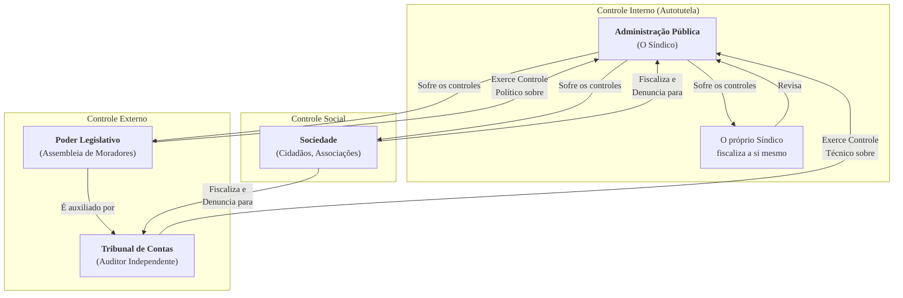

### Olá, futuro(a) aprovado(a)\! Vamos fiscalizar os conceitos de Controle da Administração Pública para garantir que sua aprovação esteja em conformidade.

Pense no Controle da Administração Pública como o **sistema de fiscalização de um grande condomínio residencial** 🏢. A "Administração" é o síndico e sua equipe. As "regras" são a convenção do condomínio e as leis. O "controle" é garantir que o síndico esteja trabalhando direito.

-----

### \#\#\# Conceito e Tipos de Controle: Quem Fiscaliza o Síndico?

  * **Classificação do Controle:**
      * **Quanto à Origem (Quem fiscaliza?):**

          * **Controle Interno:** O **próprio síndico** revisando suas contas e decisões para ver se cometeu algum erro.
          * **Controle Externo:** A **assembleia de moradores** (outro Poder) se reunindo para fiscalizar o síndico.
          * **Controle Social:** **Você, morador**, indo diretamente à administração para reclamar de um vazamento ou pedir uma cópia de um contrato.

      * **Quanto ao Momento (Quando fiscaliza?):**

          * **Prévio (*a priori*):** A assembleia precisa aprovar o orçamento da obra da piscina **antes** de ela começar.
          * **Concomitante:** Um morador fiscaliza a obra **enquanto** ela está acontecendo.
          * **Subsequente (*a posteriori*):** A assembleia analisa as notas fiscais da obra **depois** de ela ter terminado.

      * **Quanto ao Aspecto (O que fiscaliza?):**

          * **Controle de Legalidade:** Verifica se a decisão do síndico seguiu as regras da convenção e da lei. Se foi ilegal, o ato deve ser **anulado**.
          * **Controle de Mérito:** O síndico decidiu pintar o prédio de verde-limão. Não é ilegal, mas a assembleia pode achar a cor feia (inconveniente/inoportuna) e decidir pintar de branco. O ato é **revogado**.

> #### Foco Cebraspe (Pontos de Atenção e "Pegadinhas")
>
> >   * A pegadinha clássica\! A **assembleia (Controle Externo) e o juiz (Poder Judiciário)**, como regra, só podem fazer o **controle de legalidade**. Eles não podem se meter no **mérito** da decisão do síndico e dizer que a cor verde é feia. Quem faz o controle de mérito (e revoga o ato) é, primariamente, a própria administração (o síndico, percebendo o erro).

-----

### \#\#\# Controle Interno: O Síndico Fiscalizando a Si Mesmo

Este controle é baseado no **princípio da autotutela**: o poder-dever que o síndico tem de corrigir seus próprios erros.

  * **Anulação vs. Revogação (A Diferença que Mais Cai em Prova\!):**

| Ação | Motivo | Efeito | Analogia |
| :--- | :--- | :--- | :--- |
| **Anulação** | **Ilegalidade** (feriu uma regra) | **Ex Tunc** (retroage, "desde então") | O síndico fez uma obra ilegal. O ato é anulado e é como se a obra nunca tivesse sido aprovada. |
| **Revogação** | **Mérito** (não foi uma boa ideia) | **Ex Nunc** (não retroage, "daqui para frente") | O síndico instalou um chafariz barulhento. O ato não foi ilegal, mas foi inoportuno. Ele revoga a decisão, e o chafariz é desligado dali para a frente. |

  * **O Controle Interno também tem a função de apoiar o Controle Externo.** A controladoria do condomínio deve avisar a assembleia e o auditor (TCU) sobre qualquer irregularidade grave que encontrar.

> #### Foco Cebraspe (Pontos de Atenção e "Pegadinhas")
>
> >   * A banca vai dizer que um ato ilegal é revogado. **ERRADO\!** Ato **ilegal se anula**. Ato **legal, mas inoportuno, se revoga**.
> >   * A banca vai dizer que a anulação tem efeito *ex nunc*. **ERRADO\!** **Anulação = Ex Tunc (T de Testão na prova)**. **Revogação = Ex Nunc (N de Novo)**.

-----

### \#\#\# Controle Externo: A Assembleia e o Auditor Independente

É o controle de um Poder sobre o outro.

  * **Controle Parlamentar:** É a **assembleia de moradores** (Congresso Nacional) exercendo seu poder: aprovando o orçamento do condomínio, convocando o síndico para dar explicações, abrindo uma CPI para investigar uma grande obra, e, principalmente, **julgando as contas anuais do síndico** (Presidente da República).

  * **Tribunais de Contas (TCU):** É o **auditor independente e super técnico** contratado para **auxiliar** a assembleia. Ele não é subordinado à assembleia, mas tem autonomia.

> #### Foco Cebraspe (Pontos de Atenção e "Pegadinhas")
>
> >   * **Apreciar vs. Julgar:** A pegadinha de ouro\!
> >       * O TCU **NÃO julga** as contas do **síndico (Presidente)**. Ele as analisa e emite um **parecer prévio** (uma recomendação técnica). Quem bate o martelo e faz o **julgamento político** final é a **assembleia (Congresso)**.
> >       * Por outro lado, o TCU **JULGA** as contas dos **demais funcionários** da administração (ministros, diretores, etc.). A decisão do TCU, nesse caso, tem força de título executivo.
> >   * **Auxílio, não Subordinação:** A banca vai dizer que o TCU é subordinado ao Legislativo. **ERRADO\!** Ele presta auxílio técnico, mas tem autonomia e competências próprias.

-----

### \#\#\# Controle Social: O Morador de Olho

É o controle exercido por **você, morador**, diretamente sobre a gestão do condomínio.

  * **Instrumentos:**

      * **Direito de Petição / Abaixo-assinado**.
      * **Ação Popular:** Entrar na justiça para anular um ato do síndico que prejudique o patrimônio do condomínio.
      * **Lei de Acesso à Informação (LAI):** A sua ferramenta mais poderosa\! Com ela, você pode pedir cópia de qualquer contrato ou nota fiscal da administração do condomínio.

  * **Relação com os Tribunais de Contas:**
    Qualquer **morador (cidadão), partido político, associação de moradores ou sindicato** pode fazer uma **denúncia formal** diretamente ao auditor (Tribunal de Contas) sobre uma irregularidade no condomínio. O TCU é obrigado a investigar.

> #### Foco Cebraspe (Pontos de Atenção e "Pegadinhas")
>
> >   * A banca vai testar quem pode denunciar ao TCU. Lembre-se da lista: **cidadão, partido político, associação ou sindicato**.
> >   * A **LAI** é o que viabiliza o controle social eficaz. Sem acesso à informação, o morador não tem como fiscalizar.

### \#\#\# Mapa Mental: Os Tipos de Controle da Administração Pública

### **Classe:** A
### **Conteúdo:** Controle da Administração Pública: Conceito, Tipos e Formas

---

### **1. Conceito, Tipos e Formas de Controle**

> #### **TEORIA-ALVO**
> O **Controle da Administração Pública** é o conjunto de instrumentos e mecanismos por meio dos quais se exerce o poder-dever de fiscalização e de correção sobre os atos e as atividades administrativas, com o objetivo de assegurar que a atuação do Estado se mantenha em conformidade com os princípios e as normas que a regem. O controle visa garantir a legalidade, a legitimidade, a economicidade, a eficiência e a eficácia da gestão pública.
>
> * **Classificação do Controle:** O controle pode ser classificado segundo diferentes critérios:
>     * **Quanto à origem ou ao órgão que o exerce:**
>         * **Controle Interno:** É o controle que cada Poder exerce sobre seus próprios atos e agentes. Fundamenta-se no poder de autotutela da Administração.
>         * **Controle Externo:** É o controle exercido por um Poder sobre os atos de outro. O principal exemplo é o controle exercido pelo Poder Legislativo, com o auxílio do Tribunal de Contas, sobre os atos do Poder Executivo.
>         * **Controle Social:** É o controle exercido pela sociedade, diretamente ou por meio de suas associações, sobre a atividade estatal.
>     * **Quanto ao momento de exercício:**
>         * **Controle Prévio (ou *a priori*):** Realizado antes da prática ou da conclusão do ato administrativo. Ex: a aprovação prévia de um contrato pelo órgão de controle.
>         * **Controle Concomitante (ou sucessivo):** Realizado durante a execução do ato ou do contrato. Ex: a fiscalização de uma obra pública em andamento.
>         * **Controle Subsequente (ou *a posteriori*):** Realizado após a conclusão do ato. Ex: a apreciação das contas anuais de um gestor.
>     * **Quanto ao aspecto controlado:**
>         * **Controle de Legalidade:** Verifica a conformidade do ato com a lei e com o ordenamento jurídico. Se constatada uma ilegalidade, o ato deve ser anulado.
>         * **Controle de Mérito:** Analisa a conveniência e a oportunidade do ato administrativo. É uma análise de valoração discricionária. Se o ato for considerado inconveniente ou inoportuno, pode ser revogado.

> #### **FOCO CEBRASPE (Pontos de Atenção e "Pegadinhas")**
> > * **Controle de Mérito vs. Controle de Legalidade:** Esta é a distinção mais crítica. A regra geral é que o **Poder Judiciário e o Poder Legislativo (no exercício do controle externo) realizam apenas o controle de legalidade** dos atos do Poder Executivo, não podendo adentrar no mérito administrativo (análise de conveniência e oportunidade). O controle de mérito é exercido, primariamente, pela própria Administração Pública sobre seus atos (autotutela).
> > * **Classificação do Controle Exercido pelo Tribunal de Contas:** A banca frequentemente apresenta um cenário e pede a classificação. O controle exercido pelo Tribunal de Contas é **externo** (quanto à origem), pode ser **prévio, concomitante ou subsequente** (quanto ao momento) e, como regra, é de **legalidade**, podendo, contudo, realizar análises de economicidade, eficiência e eficácia no âmbito das auditorias operacionais.

---

### **Classe:** A
### **Conteúdo:** Controle Interno e Controle Administrativo

---

### **2. Controle Interno e Controle Administrativo**

> #### **TEORIA-ALVO**
> O **Controle Administrativo** é o poder-dever que a Administração Pública tem de fiscalizar e corrigir seus próprios atos e a conduta de seus agentes. É uma manifestação direta do **princípio da autotutela**.
>
> * **Autotutela (Súmulas 346 e 473 do STF):** A Administração pode anular seus próprios atos, quando eivados de vícios que os tornam ilegais, porque deles não se originam direitos; ou revogá-los, por motivo de conveniência ou oportunidade, respeitados os direitos adquiridos, e ressalvada, em todos os casos, a apreciação judicial.
>     * **Anulação:** Decorre de **ilegalidade**. Opera efeitos ***ex tunc*** (retroativos).
>     * **Revogação:** Decorre de juízo de **mérito (conveniência e oportunidade)**. Opera efeitos ***ex nunc*** (não retroativos).
> * **Controle Interno (Art. 74 da Constituição Federal):** A Constituição determina que os Poderes Legislativo, Executivo e Judiciário manterão, de forma integrada, sistema de controle interno com a finalidade de:
>     * I - avaliar o cumprimento das metas previstas no plano plurianual, a execução dos programas de governo e dos orçamentos da União;
>     * II - comprovar a legalidade e avaliar os resultados, quanto à eficácia e eficiência, da gestão orçamentária, financeira e patrimonial nos órgãos e entidades da administração federal;
>     * III - exercer o controle das operações de crédito, avais e garantias, bem como dos direitos и haveres da União;
>     * IV - apoiar o controle externo no exercício de sua missão institucional.

> #### **FOCO CEBRASPE (Pontos de Atenção e "Pegadinhas")**
> > * **Anulação vs. Revogação:** A banca vai explorar exaustivamente a diferença entre os institutos, trocando seus motivos (ilegalidade vs. mérito) e seus efeitos (*ex tunc* vs. *ex nunc*). É mandatório dominar essa distinção.
> > * **Apoio ao Controle Externo:** O sistema de controle interno tem o dever constitucional de **apoiar o controle externo**. A banca pode afirmar que são sistemas independentes e sem comunicação. **ERRADO**. Os responsáveis pelo controle interno que, ao tomarem conhecimento de qualquer irregularidade ou ilegalidade, dela não derem ciência ao Tribunal de Contas da União, são passíveis de responsabilidade solidária.
> > * **Controle de Mérito:** Somente a própria Administração pode revogar seus atos por motivo de conveniência e oportunidade. Não cabe ao Judiciário ou ao Tribunal de Contas revogar um ato administrativo por considerá-lo inoportuno.

---

### **Classe:** A
### **Conteúdo:** Controle Externo: Parlamentar e Tribunais de Contas

---

### **3. Controle Externo: Parlamentar e Tribunais de Contas**

> #### **TEORIA-ALVO**
> O **Controle Externo** da Administração Pública Federal é exercido pelo **Congresso Nacional**, com o **auxílio do Tribunal de Contas da União (TCU)**.
>
> * **Controle Parlamentar (Político):**
>     * É o controle exercido diretamente pelo Poder Legislativo. Seus principais instrumentos são a aprovação de leis orçamentárias, a fiscalização por meio de comissões (incluindo as Comissões Parlamentares de Inquérito - CPIs), a convocação de autoridades para prestar esclarecimentos e o julgamento das contas do Presidente da República, após parecer prévio do TCU.
> * **Controle pelos Tribunais de Contas:**
>     * **Natureza:** Os Tribunais de Contas são órgãos de natureza técnica e administrativa, dotados de autonomia, que auxiliam o Poder Legislativo no exercício do controle externo. Não são subordinados ao Legislativo.
>     * **Competências do TCU (Art. 71 da Constituição Federal):**
>         * **Apreciar** as contas anuais do Presidente da República, mediante parecer prévio.
>         * **Julgar** as contas dos demais administradores e responsáveis por dinheiros, bens e valores públicos.
>         * **Apreciar**, para fins de registro, a legalidade dos atos de admissão de pessoal (exceto nomeações para cargo de provimento em comissão) e das concessões de aposentadorias, reformas e pensões.
>         * Realizar, por iniciativa própria, da Câmara, do Senado, ou de comissão, inspeções e auditorias de natureza contábil, financeira, orçamentária, operacional e patrimonial.
>         * Aplicar aos responsáveis, em caso de ilegalidade de despesa ou irregularidade de contas, as sanções previstas em lei, que estabelecerá, entre outras cominações, multa proporcional ao dano causado ao erário.

> #### **FOCO CEBRASPE (Pontos de Atenção e "Pegadinhas")**
> > * **Apreciar vs. Julgar Contas:** Este é um ponto de alta incidência. O TCU **não julga** as contas do Chefe do Executivo (Presidente, Governador, Prefeito). Ele emite um **parecer prévio** recomendando a aprovação ou rejeição, e o **julgamento político** final é feito pelo respectivo **Poder Legislativo**. Em contrapartida, o TCU **julga** as contas dos demais administradores públicos (e.g., ministros, diretores de autarquias), e sua decisão, neste caso, tem força de título executivo.
> > * **Auxílio, não Subordinação:** É incorreto afirmar que o Tribunal de Contas é um órgão subordinado ao Poder Legislativo. **ERRADO**. Ele presta auxílio técnico, mas possui autonomia e competências próprias definidas na Constituição.
> > * **Atos Sujeitos a Registro:** A banca vai testar as exceções. A apreciação da legalidade para fins de registro **não se aplica** aos atos de nomeação para cargos de provimento em comissão. Também não se aplica às melhorias posteriores das aposentadorias que não alterem o fundamento legal do ato concessório.

---

### **Classe:** A
### **Conteúdo:** Controle Social

---

### **4. Controle Social e sua Relação com os Tribunais de Contas**

> #### **TEORIA-ALVO**
> O **Controle Social** é o controle exercido diretamente pela sociedade sobre as ações do Estado. É um pilar da democracia participativa e um mecanismo fundamental para garantir a transparência e a *accountability* da gestão pública.
>
> * **Instrumentos de Controle Social:**
>     * **Direito de Petição:** Direito de apresentar petições aos Poderes Públicos em defesa de direitos ou contra ilegalidade ou abuso de poder.
>     * **Ação Popular:** Ação judicial que qualquer cidadão pode propor visando anular ato lesivo ao patrimônio público, à moralidade administrativa, ao meio ambiente e ao patrimônio histórico e cultural.
>     * **Audiências e Consultas Públicas:** Mecanismos de participação popular no processo de tomada de decisão.
>     * **Conselhos de Políticas Públicas:** Órgãos com participação da sociedade civil para formular e controlar a execução de políticas públicas setoriais (e.g., Conselho de Saúde, Conselho de Educação).
>     * **Acesso à Informação:** O direito de acesso a informações públicas, regulamentado pela Lei nº 12.527/2011 (LAI), é o principal instrumento para o exercício do controle social.
> * **Relação com os Tribunais de Contas (Art. 74, § 2º, da CF):**
>     * A Constituição estabelece que **qualquer cidadão, partido político, associação ou sindicato** é parte legítima para, na forma da lei, **denunciar irregularidades ou ilegalidades perante o Tribunal de Contas da União**.
>     * Essa previsão constitucional transforma o Tribunal de Contas em um canal institucional para o exercício do controle social, onde as demandas da sociedade podem ser formalizadas e investigadas com a expertise técnica do órgão de controle externo.

> #### **FOCO CEBRASPE (Pontos de Atenção e "Pegadinhas")**
> > * **Legitimidade para Denunciar ao TCU:** A banca vai testar o conhecimento do rol de legitimados para apresentar denúncias ao Tribunal de Contas. É fundamental memorizar a lista: **cidadão, partido político, associação ou sindicato**.
> > * **Controle Social como Fonte de Auditoria:** As denúncias e representações provenientes do controle social são uma importante fonte de informação para o planejamento das auditorias e fiscalizações realizadas pelos Tribunais de Contas.
> > * **LAI como Instrumento:** A Lei de Acesso à Informação (LAI) é a principal ferramenta que viabiliza o controle social, pois sem acesso aos dados e informações sobre a gestão pública, a participação social se torna ineficaz.
