### Olá, futuro(a) aprovado(a)\! Vamos desvendar o Controle Externo na Constituição do RS para você fiscalizar sua vaga no concurso.

Pense no controle do Estado como a **gestão de um grande condomínio residencial** 🏢. O Governador é o "síndico-chefe", a Assembleia Legislativa é a "assembleia de moradores", e o Tribunal de Contas do Estado (TCE-RS) é a "empresa de auditoria independente" contratada para garantir que tudo corra bem.

-----

### \#\#\# O Modelo de Controle: Quem Fiscaliza o Síndico?

  * **O Sistema Dual (Art. 70):** A fiscalização do condomínio (Estado) é feita de duas formas:

    1.  Pelo **Controle Externo**, exercido pela **assembleia de moradores (Assembleia Legislativa)**.
    2.  Pelo **Controle Interno** de cada Poder (o próprio síndico revisando seus atos).

  * **O Papel do Auditor (TCE-RS):** A assembleia de moradores, por não ser especialista em contas, conta com o **auxílio** da empresa de auditoria independente e técnica, o **TCE-RS**.

  * **A Relação entre os Sistemas (Art. 74):** O controle interno (a equipe do síndico) tem o dever de **apoiar** o controle externo (o auditor). Se a equipe do síndico descobre uma fraude e não conta para o auditor (TCE-RS), ela se torna **cúmplice** e responde junto pelo prejuízo (**responsabilidade solidária**).

> #### Foco Cebraspe (Pontos de Atenção e "Pegadinhas")
>
> >   * **Auxílio, não Subordinação:** A banca vai dizer que o TCE-RS é subordinado à Assembleia. **ERRADO\!** O TCE **auxilia**, mas tem autonomia e poderes próprios, como um auditor independente.
> >   * **Responsabilidade Solidária:** A omissão do controle interno em comunicar uma irregularidade ao TCE-RS é uma falta grave que gera responsabilidade solidária. A banca pode tentar minimizar essa obrigação.

-----

### \#\#\# O Tribunal de Contas do Estado (TCE-RS): Quem são os Auditores?

  * **Composição (Art. 72):** A "firma de auditoria" é composta por **sete (7) auditores-chefes**, chamados de **Conselheiros**.

  * **A Escolha dos Conselheiros:**

      * **3** são indicados pela **Assembleia Legislativa** (os moradores indicam seus representantes).
      * **4** são indicados pelo **Governador** (o síndico-chefe), com as seguintes regras:
          * 2 são de livre escolha dele.
          * 2 são escolhidos de uma lista tríplice de auditores de carreira e membros do Ministério Público de Contas (uma escolha mais técnica).

  * **Prerrogativas (Garantias dos Auditores - Art. 73):**
    Para que os auditores possam trabalhar com independência, sem medo de retaliação, os **Conselheiros** têm as mesmas garantias e o mesmo salário de um **Desembargador do Tribunal de Justiça**.

> #### Foco Cebraspe (Pontos de Atenção e "Pegadinhas")
>
> >   * **Decore os Números:** A banca VAI cobrar\! **7 Conselheiros no total: 3 da Assembleia + 4 do Governador**. Qualquer troca nesses números torna a questão errada.
> >   * **A Simetria com o Judiciário:** A equiparação dos Conselheiros a **Desembargadores** é um ponto fundamental que demonstra o alto status e a autonomia do cargo.

-----

### \#\#\# Competências do TCE-RS: O Que o Auditor Pode Fazer?

Este é o artigo mais importante (Art. 71) e o que mais gera pegadinhas.

  * **Apreciar vs. Julgar Contas (A Pegadinha de Ouro\!):**

      * O TCE-RS **APRECIA** as contas anuais do **Governador (o síndico-chefe)**. Ele faz uma análise técnica profunda e emite um **parecer prévio**, como um relatório de auditoria, recomendando a aprovação ou a rejeição.
      * Quem **JULGA** politicamente as contas do Governador e dá a palavra final é a **Assembleia Legislativa (a assembleia de moradores)**.
      * Por outro lado, o TCE-RS **JULGA** as contas dos **demais administradores** (secretários, diretores de autarquias, etc.). Neste caso, a decisão do TCE é terminativa e tem força de título executivo.

  * **Outras Competências Importantes:**

      * **Apreciar a legalidade** dos atos de **admissão de pessoal** (concursos) e de **aposentadorias**.
      * **EXCEÇÃO:** Ele **NÃO** aprecia as nomeações para **cargos em comissão (CCs)**.
      * **Realizar auditorias e inspeções** por conta própria.
      * **Aplicar multas** aos responsáveis por irregularidades.
      * **Sustar a execução** de um contrato ilegal (em último caso).

> #### Foco Cebraspe (Pontos de Atenção e "Pegadinhas")
>
> >   * A banca vai afirmar categoricamente: "O TCE-RS julga as contas do Governador". **ERRADO\! ERRADO\! ERRADO\!** Ele emite um **parecer prévio**. Quem julga é a **Assembleia Legislativa**.
> >   * A exceção do **cargo em comissão** é um detalhe sempre lembrado em prova. O TCE não dá "pitaco" em quem o gestor nomeia para seus cargos de confiança.

-----

### \#\#\# Organização e Autonomia do TCE-RS

  * **Autonomia Normativa (Art. 75):** O TCE-RS tem o poder de criar seu próprio **regimento interno**. A firma de auditoria define suas próprias regras de trabalho.

  * **Ministério Público de Contas (MPC - Art. 76):**
    Existe um **"promotor de justiça especializado"** que atua junto ao TCE-RS. Ele não é do Ministério Público do Estado, é um órgão específico para atuar na fiscalização das contas, como um fiscal da lei dentro dos processos do Tribunal. O ingresso na carreira é por **concurso público**.

  * **Lei Orgânica (Art. 77):**
    A lei que detalha a organização do TCE-RS é de **iniciativa do próprio Tribunal**, o que reforça ainda mais sua autonomia.

> #### Foco Cebraspe (Pontos de Atenção e "Pegadinhas")
>
> >   * **MPC vs. MP-RS:** A banca vai tentar te confundir, dizendo que o Procurador de Justiça do MP-RS atua no TCE. **ERRADO\!** O **Ministério Público de Contas** é um órgão próprio, com carreira própria.
> >   * A iniciativa da lei orgânica ser do próprio TCE é uma manifestação de sua **autonomia** frente aos outros Poderes.

### \#\#\# Mapa Mental: A Diferença Crucial (Apreciar vs. Julgar)

```mermaid
%%{init: {"theme": "tokyo-midnight", "themeVariables": { "fontFamily": "lexend"}}}%%
graph TD
    A["Contas do<br><b>Governador</b> (Síndico-Chefe)"] --> B["<b>TCE-RS</b><br>(Auditor Independente)"];
    B -- "Emite<br><b>PARECER PRÉVIO</b><br>(Apreciação Técnica)" --> C["<b>Assembleia Legislativa</b><br>(Assembleia de Moradores)"];
    C --> D["⚖️<br><b>JULGAMENTO POLÍTICO</b><br>(Decisão Final)"];

    E["Contas dos<br><b>Demais Administradores</b><br>(Secretários, Diretores...)"] --> F["<b>TCE-RS</b><br>(Auditor Independente)"];
    F --> G["⚖️<br><b>JULGAMENTO TÉCNICO</b><br>(Decisão Terminativa)"];

    style D fill:#313149,stroke:#bb9af7
    style G fill:#313149,stroke:#7aa2f7
```

### **Classe:** A
### **Conteúdo:** Constituição do RS (artigos 70 a 77): Modelo de Controle e Fiscalização

---

### **1. O Modelo de Controle e a Relação entre os Sistemas (Arts. 70 e 74)**

> #### **TEORIA-ALVO**
> Os artigos 70 e 74 da Constituição do Estado do Rio Grande do Sul estabelecem o modelo dual de controle da Administração Pública estadual, definindo a estrutura e a inter-relação entre o controle externo e o controle interno.
>
> * **Modelo Geral de Fiscalização (Art. 70):**
>     * A fiscalização contábil, financeira, orçamentária, operacional e patrimonial do Estado e das entidades da administração direta e indireta, quanto à legalidade, legitimidade, economicidade, aplicação das subvenções e renúncia de receitas, será exercida pela **Assembleia Legislativa**, mediante **controle externo**, e pelo **sistema de controle interno** de cada Poder.
>     * O controle externo a cargo da Assembleia Legislativa é exercido com o **auxílio do Tribunal de Contas do Estado (TCE-RS)**.
>     * Prestará contas qualquer pessoa física ou jurídica, pública ou privada, que utilize, arrecade, guarde, gerencie ou administre dinheiros, bens e valores públicos.
> * **Relação entre Controle Interno e Externo (Art. 74):**
>     * Os Poderes Legislativo, Executivo e Judiciário manterão, de forma integrada, sistema de controle interno com a finalidade de, entre outras, **apoiar o controle externo** no exercício de sua missão institucional.
>     * O § 1º do art. 74 estabelece que os responsáveis pelo controle interno, ao tomarem conhecimento de qualquer irregularidade ou ilegalidade, dela darão ciência ao Tribunal de Contas do Estado, sob pena de **responsabilidade solidária**.

> #### **FOCO CEBRASPE (Pontos de Atenção e "Pegadinhas")**
> > * **Auxílio, não Subordinação:** A banca frequentemente testa a natureza da relação entre a Assembleia Legislativa e o TCE-RS. É fundamental compreender que o Tribunal de Contas **auxilia** o Poder Legislativo, não sendo um órgão subordinado a ele. O TCE-RS possui autonomia e competências próprias outorgadas diretamente pela Constituição.
> > * **Responsabilidade Solidária do Controle Interno:** Este é um ponto crítico. A omissão do gestor do controle interno em comunicar uma irregularidade conhecida ao TCE-RS acarreta sua responsabilização solidária pelo dano. A banca pode afirmar que a responsabilidade é meramente administrativa ou que não existe tal obrigação. **ERRADO**.
> > * **Abrangência da Fiscalização:** A fiscalização do TCE-RS abrange não apenas os órgãos públicos, mas também qualquer entidade privada que gerencie recursos públicos, reforçando o caráter amplo do controle.

---

### **Classe:** A
### **Conteúdo:** O Tribunal de Contas do Estado (TCE-RS): Composição e Prerrogativas

---

### **2. O Tribunal de Contas do Estado (TCE-RS): Composição e Prerrogativas (Arts. 72 e 73)**

> #### **TEORIA-ALVO**
> Os artigos 72 e 73 da Constituição Estadual detalham a estrutura do TCE-RS, definindo o número de seus membros, o processo de nomeação e as garantias que asseguram sua independência e imparcialidade.
>
> * **Composição (Art. 72):**
>     * O Tribunal de Contas do Estado é integrado por **sete Conselheiros**.
>     * A nomeação é de competência do Governador do Estado, com a aprovação da Assembleia Legislativa.
> * **Processo de Escolha dos Conselheiros (Art. 72, § 1º):**
>     * **Três** são indicados pela **Assembleia Legislativa**.
>     * **Quatro** são indicados pelo **Governador do Estado**, sendo que, destes quatro, dois são de sua livre escolha, e os outros dois são escolhidos alternadamente dentre **Auditores** e membros do **Ministério Público de Contas**, indicados em lista tríplice pelo próprio Tribunal.
> * **Requisitos para Nomeação:** Os Conselheiros devem satisfazer requisitos de idoneidade moral, reputação ilibada, notórios conhecimentos jurídicos, contábeis, econômicos, financeiros ou de administração pública, e possuir mais de trinta e cinco e menos de sessenta e cinco anos de idade.
> * **Prerrogativas (Art. 73):**
>     * Os **Conselheiros** do Tribunal de Contas do Estado terão as mesmas garantias, prerrogativas, impedimentos, vencimentos e vantagens dos **Desembargadores do Tribunal de Justiça**.
>     * Os **Auditores Substitutos de Conselheiro**, quando em substituição a Conselheiro, terão as mesmas garantias e impedimentos do titular e, quando no exercício das demais atribuições da judicatura, as de **Juiz de Direito de última entrância**.

> #### **FOCO CEBRASPE (Pontos de Atenção e "Pegadinhas")**
> > * **Números e Proporções na Escolha:** Os números relativos à composição e ao processo de escolha são alvos certos de questões. É mandatório memorizar: **7 Conselheiros no total**, sendo **3 indicados pela Assembleia Legislativa** e **4 pelo Governador**, com as regras específicas para as escolhas do Governador. A banca vai inverter ou alterar esses números.
> > * **Simetria com o Tribunal de Justiça:** A equiparação das garantias e vencimentos dos Conselheiros aos de **Desembargadores** do TJRS é um ponto fundamental para aferir o status do cargo e a autonomia do órgão.
> > * **Lista Tríplice:** A exigência de lista tríplice para a escolha de Auditores e membros do Ministério Público de Contas é um mecanismo que visa garantir uma escolha técnica e com a participação do próprio Tribunal, limitando a discricionariedade do Chefe do Executivo.

---

### **Classe:** A
### **Conteúdo:** Competências do Tribunal de Contas do Estado (TCE-RS)

---

### **3. Competências do Tribunal de Contas do Estado (Art. 71)**

> #### **TEORIA-ALVO**
> O artigo 71 da Constituição do Estado do Rio Grande do Sul espelha o artigo 71 da Constituição Federal, detalhando o rol de competências do TCE-RS. É o artigo mais importante para a definição da atuação do órgão.
>
> * **Competências Principais:**
>     * **I - Apreciar as contas** prestadas anualmente pelo Governador do Estado, mediante **parecer prévio**, que deverá ser elaborado em sessenta dias a contar de seu recebimento.
>     * **II - Julgar as contas** dos administradores e demais responsáveis por dinheiros, bens e valores públicos da administração direta e indireta, incluídas as fundações e sociedades instituídas e mantidas pelo Poder Público estadual, e as contas daqueles que derem causa a perda, extravio ou outra irregularidade de que resulte prejuízo ao erário.
>     * **III - Apreciar, para fins de registro, a legalidade** dos atos de **admissão de pessoal**, a qualquer título, na administração direta e indireta, **excetuadas as nomeações para cargo de provimento em comissão**, bem como a das **concessões de aposentadorias, reformas e pensões**, ressalvadas as melhorias posteriores que não alterem o fundamento legal do ato concessório.
>     * **IV - Realizar inspeções e auditorias** de natureza contábil, financeira, orçamentária, operacional e patrimonial.
>     * **VI - Fiscalizar a aplicação de quaisquer recursos** repassados pelo Estado mediante convênio, acordo, ajuste ou outros instrumentos congêneres.
>     * **VIII - Aplicar aos responsáveis**, em caso de ilegalidade de despesa ou irregularidade de contas, as **sanções** previstas em lei, que estabelecerá, entre outras cominações, **multa** proporcional ao dano causado ao erário.
>     * **IX e X - Assinar prazo** para que o órgão ou entidade adote as providências necessárias ao exato cumprimento da lei e, em caso de não atendimento, **sustar a execução do ato impugnado**, comunicando a decisão à Assembleia Legislativa.

> #### **FOCO CEBRASPE (Pontos de Atenção e "Pegadinhas")**
> > * **Apreciar vs. Julgar:** Esta é a distinção mais clássica e de maior incidência em provas. O TCE-RS **APRECIA** as contas do Governador e emite um parecer, mas quem as **JULGA** é a **Assembleia Legislativa**. O TCE-RS **JULGA** as contas dos demais administradores. A banca vai afirmar que o TCE-RS julga as contas do Governador. **ERRADO**.
> > * **Exceção do Cargo em Comissão:** A banca frequentemente testa as exceções. O TCE-RS aprecia para fins de registro os atos de admissão de pessoal, **EXCETO** as nomeações para **cargos em comissão**.
> > * **Natureza da Decisão em Contas:** A decisão do TCE-RS que imputa débito ou multa tem eficácia de **título executivo extrajudicial**.
> > * **Sustação de Contrato:** O procedimento para sustar um contrato ilegal é um ponto de atenção. A regra é que o TCE determine a correção. Se não for atendido, comunica à Assembleia Legislativa para que esta suste. Se a Assembleia não o fizer, o Tribunal poderá decidir a respeito. A ação direta do TCE é subsidiária.

---

### **Classe:** A
### **Conteúdo:** Organização e Autonomia do TCE-RS

---

### **4. Organização e Autonomia do TCE-RS (Arts. 75, 76 e 77)**

> #### **TEORIA-ALVO**
> Os artigos finais da seção detalham aspectos da autonomia e da estrutura organizacional do Tribunal de Contas do Estado.
>
> * **Autonomia Normativa (Art. 75):** O Tribunal de Contas do Estado tem o poder de elaborar seu **regimento interno**, dispor sobre sua organização e funcionamento, e exercer sua polícia administrativa. Isso confere ao órgão autonomia para definir suas próprias regras processuais e administrativas, dentro dos limites da Constituição e das leis.
> * **Ministério Público de Contas (Art. 76):**
>     * **Previsão:** A Constituição Estadual prevê que funcionará junto ao Tribunal de Contas um **Ministério Público de Contas (MPC)**.
>     * **Composição e Ingresso:** O MPC é composto por um Procurador-Geral e por Procuradores. O ingresso na carreira de Procurador do MPC se dá mediante **concurso público de provas e títulos**.
>     * **Atuação:** O MPC atua como fiscal da lei (*custos legis*) e da ordem jurídica nos processos que tramitam no TCE-RS, garantindo a defesa do patrimônio público.
> * **Lei Orgânica (Art. 77):**
>     * A Constituição determina que uma **lei complementar**, de iniciativa do próprio Tribunal de Contas, disporá sobre sua organização, funcionamento e jurisdição.

> #### **FOCO CEBRASPE (Pontos de Atenção e "Pegadinhas")**
> > * **Autonomia do TCE:** O poder de elaborar seu próprio regimento interno é uma das mais importantes manifestações da autonomia administrativa e funcional do Tribunal de Contas.
> > * **Ministério Público de Contas vs. Ministério Público Estadual:** A banca pode induzir o candidato ao erro, tratando os dois órgãos como se fossem o mesmo. **ERRADO**. O **Ministério Público de Contas** é um órgão independente que atua **junto ao Tribunal de Contas**. O **Ministério Público do Estado do Rio Grande do Sul** é outro órgão, com atribuições distintas, pertencente à estrutura do Poder Executivo para fins orçamentários, mas com autonomia funcional.
> > * **Iniciativa da Lei Orgânica:** A competência para a iniciativa do projeto de lei complementar que dispõe sobre a organização do TCE-RS é do **próprio Tribunal**, o que reforça sua autonomia perante os demais Poderes.
