### Olá, futuro(a) aprovado(a)\! Vamos fiscalizar os conceitos de Controle da Atividade Financeira do Estado para garantir que sua aprovação esteja nos conformes.

Pense no controle da administração pública como a **gestão e fiscalização de um grande condomínio residencial** 🏢. O "Estado" é o condomínio, o "governo" é o síndico, as "leis" são a convenção do condomínio, e o "controle" é garantir que o síndico esteja usando o dinheiro de todos corretamente.

-----

### \#\#\# Conceito e Classificação do Controle: Quem Fiscaliza o Síndico e Como?

O **Controle da Atividade Financeira** é o poder-dever de verificar se o síndico está seguindo as regras e usando bem o dinheiro do condomínio.

  * **As Espécies e Formas de Controle:**
    A fiscalização pode ser classificada de três maneiras principais:

    1.  **Quanto à Origem (Quem fiscaliza?):**

          * **Controle Interno:** O **próprio síndico** e sua equipe revisando suas próprias contas e decisões.
          * **Controle Externo:** A **assembleia de moradores** (outro Poder) fiscalizando as contas e os atos do síndico.

    2.  **Quanto ao Momento (Quando fiscaliza?):**

          * **Prévio (*a priori*):** A assembleia precisa aprovar o orçamento da reforma da piscina **antes** de o síndico começar a obra.
          * **Concomitante:** Um morador fiscaliza a obra da piscina **enquanto** ela está acontecendo.
          * **Subsequente (*a posteriori*):** A assembleia analisa as notas fiscais da obra **depois** de ela ter terminado.

    3.  **Quanto ao Aspecto (O que fiscaliza?):**

          * **Controle de Legalidade:** Verifica se a obra seguiu as regras da convenção e da prefeitura.
          * **Controle de Mérito:** Analisa se a decisão foi boa. O síndico decidiu pintar a fachada de rosa-choque. Não é ilegal, mas foi uma decisão de mau gosto (inconveniente/inoportuna).

> #### Foco Cebraspe (Pontos de Atenção e "Pegadinhas")
>
> >   * **Controle de Mérito:** A pegadinha clássica\! A **assembleia (Controle Externo) e um juiz (Poder Judiciário)**, como regra, só podem fazer o **controle de legalidade**. Eles não podem anular a decisão de pintar de rosa-choque só porque acharam a cor feia. Quem pode mudar a cor por uma questão de mérito é o próprio síndico (autotutela) ou a administração superior.
> >   * O controle não é uma opção, é um **poder-dever**.

-----

### \#\#\# Os Sistemas de Controle Interno e Externo

A Constituição organizou a fiscalização em dois grandes sistemas.

  * **Sistema de Controle Interno:**

      * É a **controladoria interna** do síndico. Cada Poder (Executivo, Legislativo, Judiciário) tem o seu.
      * Uma de suas principais finalidades constitucionais é **apoiar o controle externo**. A controladoria do síndico deve preparar os relatórios e organizar as contas para facilitar a fiscalização pela assembleia.
      * Se a controladoria interna descobre uma fraude e não avisa o Tribunal de Contas, ela se torna **cúmplice (responsabilidade solidária)**.

  * **Sistema de Controle Externo:**

      * O titular desse controle é a **assembleia de moradores (Poder Legislativo)**.
      * Como os moradores não são especialistas em contabilidade, eles contam com o **auxílio** de um órgão técnico e autônomo, a "empresa de auditoria independente" do condomínio, que é o **Tribunal de Contas**.

> #### Foco Cebraspe (Pontos de Atenção e "Pegadinhas")
>
> >   * **Apoio é Dever:** A banca vai dizer que os sistemas são independentes e não se falam. **ERRADO\!** O controle interno tem o **dever constitucional de apoiar** o externo.
> >   * **Auxílio, não Subordinação:** A banca vai dizer que o Tribunal de Contas é subordinado ao Poder Legislativo. **ERRADO\!** Ele **auxilia**, mas não recebe ordens. Ele tem autonomia e poderes próprios vindos diretamente da Constituição.

-----

### \#\#\# O Papel do Tribunal de Contas: O que o Auditor do Condomínio Faz?

O Tribunal de Contas (TC) é o especialista em fiscalizar as contas.

  * **Apreciar vs. Julgar Contas (A PEGADINHA DE OURO\!):**

      * O TC **NÃO JULGA** as contas gerais anuais do **síndico-chefe (Presidente, Governador, Prefeito)**. Ele as **APRECIA** e emite um **parecer prévio** (um relatório técnico), recomendando a aprovação ou rejeição.
      * Quem **JULGA** politicamente e dá a palavra final sobre as contas do síndico-chefe é a **assembleia de moradores (Poder Legislativo)**.
      * Por outro lado, o TC **JULGA** as contas dos **demais administradores** (ministros, secretários, diretores de estatais). A decisão do TC, neste caso, é definitiva e vira um título de cobrança.

  * **Outras Funções Importantes:**

      * **Apreciar a legalidade** da contratação de servidores concursados e da concessão de aposentadorias.
      * **EXCEÇÃO:** Ele **NÃO** analisa a nomeação de **cargos em comissão (CCs)**.
      * **Controle Social:** Qualquer **morador (cidadão), partido político, associação de moradores ou sindicato** pode fazer uma **denúncia formal** diretamente ao Tribunal de Contas sobre uma irregularidade no condomínio.

> #### Foco Cebraspe (Pontos de Atenção e "Pegadinhas")
>
> >   * A banca vai afirmar categoricamente: "O Tribunal de Contas julga as contas do Chefe do Executivo". **ERRADO, ERRADO, ERRADO\!** Ele emite um **parecer prévio**. Quem julga é o **Legislativo**.
> >   * A exceção do **cargo em comissão** é um detalhe sempre lembrado em prova.
> >   * A decisão do TC que condena um gestor a devolver dinheiro tem força de **título executivo extrajudicial**.

### \#\#\# Mapa Mental: As Classificações do Controle

```mermaid
%%{init: {"theme": "tokyo-midnight", "themeVariables": { "fontFamily": "lexend"}}}%%
graph TD
    A["<b>Controle da<br>Atividade Financeira</b>"]
    
    subgraph "Quanto à Origem"
        B["<b>Interno</b><br>(O próprio Poder)"]
        C["<b>Externo</b><br>(Um Poder sobre o outro)"]
    end

    subgraph "Quanto ao Momento"
        D["<b>Prévio</b><br>(Antes do ato)"]
        E["<b>Concomitante</b><br>(Durante o ato)"]
        F["<b>Subsequente</b><br>(Depois do ato)"]
    end

    subgraph "Quanto ao Aspecto"
        G["<b>De Legalidade</b><br>(Conformidade com a lei)"]
        H["<b>De Mérito</b><br>(Conveniência e Oportunidade)"]
    end

    A --> B & C
    A --> D & E & F
    A --> G & H

    style B fill:#313149,stroke:#bb9af7
    style C fill:#313149,stroke:#bb9af7
    style D fill:#313149,stroke:#7aa2f7
    style E fill:#313149,stroke:#7aa2f7
    style F fill:#313149,stroke:#7aa2f7
    style G fill:#313149,stroke:#7dcfff
    style H fill:#313149,stroke:#7dcfff

```

### **Classe:** A
### **Conteúdo:** Controle da Atividade Financeira do Estado: Conceito e Classificação

---

### **1. Conceito e Classificação do Controle da Atividade Financeira do Estado**

> #### **TEORIA-ALVO**
> A **Atividade Financeira do Estado** compreende o conjunto de atos do Poder Público destinados à obtenção de receitas, à gestão do patrimônio e à realização de despesas para o atingimento do bem comum. O **Controle da Atividade Financeira** é a verificação da conformidade dessa gestão com o ordenamento jurídico, abrangendo os aspectos orçamentário, financeiro, patrimonial e contábil.
>
> * **Objeto do Controle:** O controle incide sobre todos os atos de gestão que envolvam recursos públicos, incluindo a arrecadação de tributos, a execução orçamentária, as licitações e contratos, e a gestão de bens públicos.
> * **Espécies e Formas de Controle (Classificação):** O controle é classificado segundo três critérios principais:
>     1.  **Quanto à Posição do Órgão Controlador (Origem):**
>         * **Controle Interno:** É aquele realizado pela própria entidade ou Poder sobre seus próprios atos. Cada Poder (Executivo, Legislativo e Judiciário) e o Ministério Público devem manter seu sistema de controle interno.
>         * **Controle Externo:** É o controle exercido por um Poder sobre os atos praticados por outro. O exemplo precípuo é o controle exercido pelo Poder Legislativo, com o auxílio do Tribunal de Contas, sobre a Administração Pública.
>     2.  **Quanto ao Momento de Realização:**
>         * **Controle Prévio (*a priori*):** Realizado antes da consumação do ato financeiro. Exemplo: análise de um edital de licitação pelo Tribunal de Contas.
>         * **Controle Concomitante:** Realizado durante a execução do ato. Exemplo: acompanhamento da execução de um contrato de obra pública.
>         * **Controle Subsequente (*a posteriori*):** Realizado após a conclusão do ato. Exemplo: julgamento das contas anuais de um gestor público.
>     3.  **Quanto ao Aspecto Controlado:**
>         * **Controle de Legalidade:** Verifica a conformidade do ato com a lei e os princípios que regem a Administração Pública.
>         * **Controle de Mérito:** Analisa a conveniência e a oportunidade do ato administrativo.

> #### **FOCO CEBRASPE (Pontos de Atenção e "Pegadinhas")**
> > * **Controle de Mérito:** A banca frequentemente explora os limites deste controle. A regra geral é que o **Poder Judiciário e o Tribunal de Contas não realizam controle de mérito** sobre os atos discricionários da Administração, limitando-se ao controle de legalidade. O controle de mérito é uma prerrogativa exercida primariamente pela própria Administração, em decorrência de seu poder de autotutela.
> > * **Classificação dos Atos do Tribunal de Contas:** Uma questão típica apresentará uma atuação do Tribunal de Contas e solicitará sua classificação. A análise de um edital de licitação é controle **externo, prévio e de legalidade**. O julgamento de contas é controle **externo, subsequente e de legalidade**.
> > * **Obrigatoriedade do Controle:** O controle não é uma faculdade, mas um **poder-dever** imposto a todos os Poderes, como um dos pilares do sistema de freios e contrapesos (*checks and balances*).

---

### **Classe:** A
### **Conteúdo:** Os Sistemas de Controle Interno e Externo

---

### **2. Os Sistemas de Controle Interno e Externo**

> #### **TEORIA-ALVO**
> A Constituição Federal de 1988 estruturou o controle da atividade financeira do Estado em dois grandes sistemas: o sistema de controle interno de cada Poder e o sistema de controle externo a cargo do Poder Legislativo.
>
> * **Sistema de Controle Interno:**
>     * **Fundamento Constitucional:** Art. 74 da Constituição Federal.
>     * **Estrutura:** Determina que os Poderes Legislativo, Executivo e Judiciário manterão, de forma **integrada**, um sistema de controle interno. No âmbito do Poder Executivo Federal, o órgão central deste sistema é a Controladoria-Geral da União (CGU).
>     * **Finalidades (Art. 74):**
>         1.  Avaliar o cumprimento de metas do plano plurianual e a execução de programas de governo e orçamentos.
>         2.  Comprovar a legalidade e avaliar os resultados (eficácia e eficiência) da gestão orçamentária, financeira e patrimonial.
>         3.  Exercer o controle sobre operações de crédito, avais e garantias.
>         4.  **Apoiar o controle externo** no exercício de sua missão institucional.
> * **Sistema de Controle Externo:**
>     * **Fundamento Constitucional:** Art. 70 e 71 da Constituição Federal.
>     * **Titularidade:** O controle externo é de titularidade do **Congresso Nacional** (na esfera federal) e das respectivas Assembleias Legislativas e Câmaras Municipais.
>     * **Órgão Auxiliar:** O **Tribunal de Contas** é o órgão de natureza técnica que **auxilia** o Poder Legislativo no exercício do controle externo, mas possui autonomia e competências próprias definidas na Constituição.

> #### **FOCO CEBRASPE (Pontos de Atenção e "Pegadinhas")**
> > * **Dever de Apoio do Controle Interno:** Este é um ponto crucial da relação entre os sistemas. O controle interno tem o dever constitucional de **apoiar o controle externo**. A banca pode afirmar que são sistemas estanques e sem comunicação. **ERRADO**. O art. 74, § 1º, estabelece que os responsáveis pelo controle interno, ao tomarem conhecimento de qualquer irregularidade ou ilegalidade, dela darão ciência ao Tribunal de Contas, sob pena de responsabilidade solidária.
> > * **Integração do Controle Interno:** A Constituição exige que o sistema de controle interno de cada Poder seja mantido de forma **integrada**.
> > * **Auxílio, não Subordinação:** É incorreto afirmar que o Tribunal de Contas é um órgão subordinado ao Poder Legislativo. **ERRADO**. O Tribunal de Contas **auxilia** o Legislativo, mas não se subordina a ele, exercendo com autonomia as competências que lhe foram outorgadas diretamente pela Constituição.

---

### **Classe:** A
### **Conteúdo:** O Papel do Tribunal de Contas no Controle Financeiro

---

### **3. O Papel do Tribunal de Contas no Controle Financeiro**

> #### **TEORIA-ALVO**
> O Tribunal de Contas é o órgão especializado no controle externo da atividade financeira do Estado, exercendo funções de natureza fiscalizadora, judicante, consultiva e sancionatória. Suas competências estão detalhadas no Art. 71 da Constituição Federal.
>
> * **Principais Competências do Tribunal de Contas:**
>     * **Apreciar as contas** prestadas anualmente pelo Chefe do Poder Executivo, mediante a elaboração de um **parecer prévio**.
>     * **Julgar as contas** dos demais administradores e responsáveis por recursos públicos. A decisão que condena o gestor ao ressarcimento do dano tem eficácia de **título executivo extrajudicial**.
>     * **Apreciar a legalidade**, para fins de registro, dos atos de admissão de pessoal (exceto nomeações para cargo em comissão) e de concessão de aposentadorias, reformas e pensões.
>     * Realizar inspeções e auditorias por iniciativa própria ou por solicitação do Poder Legislativo.
>     * Fiscalizar a aplicação de quaisquer recursos repassados pela União mediante convênio, acordo, ajuste ou outros instrumentos congêneres.
>     * Aplicar aos responsáveis as sanções previstas em lei, como **multas**.
>     * Determinar a **sustação** de contratos, se verificada ilegalidade.
>
> * **Controle Social e o Tribunal de Contas:**
>     * Conforme o Art. 74, § 2º, da Constituição, **qualquer cidadão, partido político, associação ou sindicato** é parte legítima para, na forma da lei, **denunciar irregularidades ou ilegalidades** perante o Tribunal de Contas.

> #### **FOCO CEBRASPE (Pontos de Atenção e "Pegadinhas")**
> > * **Apreciar vs. Julgar Contas:** Este é um dos pontos mais importantes e frequentemente cobrados. O Tribunal de Contas **NÃO JULGA** as contas do Chefe do Poder Executivo (Presidente, Governador ou Prefeito). Ele **APRECIA** as contas e emite um **parecer prévio**, que subsidiará o **julgamento político** a ser realizado pelo respectivo Poder Legislativo. Em contrapartida, o Tribunal de Contas **JULGA** as contas dos demais administradores públicos (e.g., Ministros, Secretários, diretores de autarquias).
> > * **Atos Sujeitos a Registro:** A banca vai explorar as exceções. O Tribunal de Contas aprecia a legalidade dos atos de admissão de pessoal, **EXCETO** as nomeações para **cargos de provimento em comissão**.
> > * **Sustação de Contratos:** O Tribunal de Contas pode assinar prazo para que o órgão adote as providências necessárias ao exato cumprimento da lei. Se não atendido, o TC comunica a decisão à Câmara dos Deputados e ao Senado Federal. Se ainda assim o ato não for sustado, o Tribunal poderá decidir a respeito. A sustação do contrato pelo Legislativo é a regra; a decisão direta pelo TC é a exceção.
