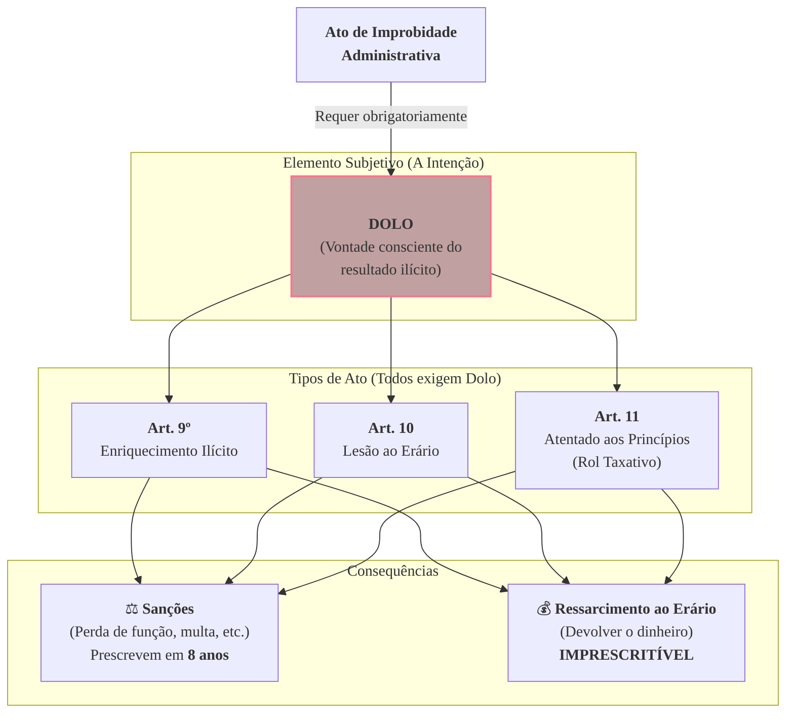

### Olá, futuro(a) aprovado(a)\! Vamos desvendar a nova Lei de Improbidade Administrativa para você não cometer nenhum erro na prova do Cebraspe.

Pense na Lei de Improbidade como o **regulamento interno super rígido de um condomínio** 🏢. A "Administração Pública" é o condomínio, o "agente público" é o síndico, e a lei define as infrações gravíssimas que podem levar à expulsão do síndico e a multas pesadas. A lei foi muito alterada em 2021, e o Cebraspe vai cobrar as novidades\!

-----

### \#\#\# Disposições Gerais: Quem Pode Ser Punido e Com Qual Intenção?

  * **Os Sujeitos da Infração:**

      * **Sujeito Ativo (Quem comete a infração?):**
        1.  **O Agente Público (O Síndico):** O conceito é super amplo. É qualquer um que trabalha para o condomínio, desde o síndico eleito, passando pelo funcionário contratado, até o estagiário. Vale mesmo se o trabalho for temporário ou sem salário (como o mesário da eleição para síndico).
        2.  **O Terceiro (O Morador Cúmplice):** Um morador ou uma empresa que **ajuda o síndico a cometer a fraude de propósito**. Ex: o dono da empresa de jardinagem que combina um superfaturamento com o síndico. O morador não pode ser punido sozinho; ele precisa agir em conluio com um agente público.

  * **O Elemento Subjetivo (A Intenção do Infrator):**

      * **A MAIOR MUDANÇA DA LEI\!** Antes, o síndico podia ser punido se causasse um prejuízo por "desleixo" (culpa). Agora não mais.
      * Para **TODOS** os atos de improbidade, a nova lei exige a comprovação de **DOLO**.
      * **O que é dolo para a lei?** É a **vontade livre e consciente de alcançar o resultado ilícito**. Não basta querer fazer o ato; é preciso querer o resultado ilegal. Simplesmente desobedecer uma regra, sem a intenção de cometer a ilegalidade, não é mais improbidade.

> #### Foco Cebraspe (Pontos de Atenção e "Pegadinhas")
>
> >   * **A EXIGÊNCIA DE DOLO:** Esta é a pegadinha de ouro\! A banca vai criar um cenário onde um prefeito, por pura incompetência e negligência (culpa), causa um prejuízo milionário. Pela nova lei, isso **NÃO É** mais ato de improbidade. Precisa provar a intenção, o dolo.
> >   * **Conceito de Agente Público:** A banca vai tentar restringir. Lembre-se, o conceito é **amplo**.
> >   * **O Terceiro:** O particular só responde se agir junto e com a mesma intenção dolosa do agente público.

-----

### \#\#\# Os Atos de Improbidade: As Infrações Gravíssimas

A lei divide as "infrações" em 3 categorias. Lembre-se, todas agora exigem **DOLO**.

| Tipo de Ato | Artigo | O que é? | Foco Principal | Analogia do Síndico |
| :--- | :-: | :--- | :--- | :--- |
| **Enriquecimento Ilícito** | **Art. 9º** | Receber qualquer vantagem patrimonial indevida. | No **GANHO** do agente. | O síndico recebe propina de uma empresa para ganhar a licitação da reforma da piscina. |
| **Lesão ao Erário** | **Art. 10** | Causar, de propósito, um prejuízo financeiro ao poder público. | No **PREJUÍZO** do condomínio. | O síndico, para favorecer um amigo, contrata uma obra por um preço superfaturado. |
| **Atentado aos Princípios** | **Art. 11** | Violar os deveres de honestidade, imparcialidade e legalidade. | Na **DESONESTIDADE** da conduta. | O síndico nomeia a própria esposa para um cargo de confiança remunerado no condomínio (nepotismo). |

> #### Foco Cebraspe (Pontos de Atenção e "Pegadinhas")
>
> >   * **Rol Taxativo do Art. 11:** Outra mudança gigante\! Antes, qualquer violação a um princípio da administração poderia ser improbidade. Agora, a conduta precisa estar **expressamente listada** em um dos incisos do Art. 11. Se não estiver na lista, não é improbidade deste tipo.
> >   * **Lesão ao Erário (Art. 10):** O prejuízo precisa ser **efetivo e comprovado**. Uma mera irregularidade formal que não causou dano financeiro não é mais considerada improbidade deste tipo.

-----

### \#\#\# Sanções e Prescrição: A Punição e o Prazo de Validade

  * **As Sanções (As Punições):**
    Se condenado, o síndico pode sofrer punições pesadas, como:

      * Perder os bens que adquiriu ilegalmente.
      * Perder o cargo de síndico.
      * Ter os direitos políticos suspensos (não pode votar nem ser eleito por um tempo).
      * Pagar uma multa civil pesada.
      * Ficar proibido de contratar com o poder público.

  * **Ressarcimento vs. Sanções (A Dívida e a Pena):**

      * A obrigação de **devolver o dinheiro** que foi desviado do condomínio (**ressarcimento**) é **IMPRESCRITÍVEL**. O condomínio pode cobrar essa dívida para sempre.
      * A aplicação das **outras punições** (perder o cargo, pagar multa, etc.) **PRESCREVE**.

  * **Prescrição (O Prazo para Punir):**

      * **A Grande Mudança da Lei:** O prazo para o Ministério Público entrar com a ação para aplicar as sanções de improbidade é agora de **8 ANOS**, contados a partir da data em que o fato ocorreu.

> #### Foco Cebraspe (Pontos de Atenção e "Pegadinhas")
>
> >   * **Imprescritibilidade do Ressarcimento:** A banca vai dizer que a "ação de improbidade é imprescritível". **ERRADO\!** A ação para **aplicar as sanções prescreve em 8 anos**. O que é imprescritível é a ação para pedir o **ressarcimento** do dano.
> >   * **Quem pode entrar com a ação?** Outra mudança fundamental\! Agora, a ação de improbidade só pode ser proposta pelo **MINISTÉRIO PÚBLICO**. O condomínio (a entidade lesada) pode participar do processo, mas não pode iniciá-lo.

### \#\#\# Mapa Mental: A Nova Lei de Improbidade em Resumo

### **Classe:** A
### **Conteúdo:** Lei de Improbidade Administrativa: Disposições Gerais e Sujeitos

---

### **1. Disposições Gerais: Sujeitos e Elemento Subjetivo**

> #### **TEORIA-ALVO**
> A **Lei nº 8.429/1992**, com as profundas alterações promovidas pela **Lei nº 14.230/2021**, dispõe sobre as sanções aplicáveis em virtude da prática de atos de improbidade administrativa. O objetivo da norma é a proteção da probidade na organização do Estado e no exercício de suas funções, como corolário do princípio da moralidade administrativa.
>
> * **Sujeitos do Ato de Improbidade:**
>     * **Sujeito Ativo:** É quem pratica o ato de improbidade. A lei define duas categorias:
>         1.  **Agente Público (Art. 2º):** Conceito amplo que abrange todo aquele que exerce, ainda que transitoriamente ou sem remuneração, por eleição, nomeação, designação, contratação ou qualquer outra forma de investidura ou vínculo, mandato, cargo, emprego ou função nas entidades da Administração Pública.
>         2.  **Terceiro (Art. 3º):** Particular, pessoa física ou jurídica, que, mesmo não sendo agente público, **induza ou concorra dolosamente** para a prática do ato de improbidade ou dele se beneficie sob qualquer forma direta ou indireta.
>     * **Sujeito Passivo:** A entidade pública lesada pelo ato, incluindo a administração direta, indireta ou fundacional de qualquer dos Poderes da União, dos Estados, do Distrito Federal e dos Municípios.
> * **Elemento Subjetivo do Ato de Improbidade:**
>     * A Lei nº 14.230/2021 estabeleceu uma mudança fundamental no elemento subjetivo necessário para a configuração do ato de improbidade.
>     * Para **TODOS** os atos de improbidade (enriquecimento ilícito, lesão ao erário e atentado aos princípios), passou-se a exigir a comprovação de **DOLO**.
>     * **Definição de Dolo (Art. 1º, § 2º):** A vontade livre e consciente de alcançar o resultado ilícito tipificado nos arts. 9º, 10 e 11 da Lei, não bastando a voluntariedade do agente. A mera violação da legalidade ou o voluntarismo sem comprovação do fim ilícito não configuram improbidade.

> #### **FOCO CEBRASPE (Pontos de Atenção e "Pegadinhas")**
> > * **Exigência de DOLO:** Este é o ponto mais crítico e a principal alteração da lei. A banca irá apresentar cenários em que um agente público age com **culpa** (negligência, imperícia ou imprudência), causando, por exemplo, um prejuízo ao erário. De acordo com a nova redação da lei, tal conduta **NÃO** configura mais ato de improbidade administrativa. É imprescindível a comprovação do dolo específico.
> > * **Conceito de Agente Público:** A definição legal é extremamente ampla. A banca pode tentar restringi-la, afirmando, por exemplo, que um estagiário ou um mesário eleitoral não se enquadram no conceito. **ERRADO**. Ambos exercem função pública, ainda que transitoriamente e, no caso do mesário, sem remuneração.
> > * **Responsabilidade do Terceiro:** É incorreto afirmar que um particular pode, isoladamente, cometer um ato de improbidade administrativa. **ERRADO**. A responsabilização do terceiro depende, necessariamente, de seu concurso doloso com um agente público.

---

### **Classe:** A
### **Conteúdo:** Atos de Improbidade Administrativa

---

### **2. Atos de Improbidade Administrativa**

> #### **TEORIA-ALVO**
> A Lei nº 8.429/1992 tipifica os atos de improbidade em três categorias distintas. A comprovação de dolo é requisito para todas elas.
>
> * **Art. 9º - Atos que Importam Enriquecimento Ilícito:**
>     * **Conduta:** Auferir, mediante a prática de ato doloso, qualquer tipo de vantagem patrimonial indevida em razão do exercício de cargo, de mandato, de função, de emprego ou de atividade nas entidades públicas.
>     * **Exemplos:** Receber vantagem econômica para facilitar uma contratação; utilizar, em proveito próprio, bens, rendas ou verbas públicas.
> * **Art. 10 - Atos que Causam Lesão ao Erário:**
>     * **Conduta:** Ação ou omissão, dolosa, que enseje, efetiva e comprovadamente, perda patrimonial, desvio, apropriação, malbaratamento ou dilapidação dos bens ou haveres das entidades públicas.
>     * **Exemplos:** Frustrar a licitude de processo licitatório ou de processo seletivo para celebração de parcerias; permitir ou facilitar a aquisição de bem ou a contratação de serviço por preço superior ao de mercado.
>     * **Alteração Relevante:** A nova lei exige que a lesão ao erário seja **efetiva e comprovada**. A mera irregularidade formal sem dano patrimonial não configura este tipo de improbidade.
> * **Art. 11 - Atos que Atentam Contra os Princípios da Administração Pública:**
>     * **Conduta:** Ação ou omissão dolosa que viole os deveres de honestidade, de imparcialidade e de legalidade.
>     * **Alteração Relevante:** Com a Lei nº 14.230/2021, o rol de condutas do art. 11 passou a ser **taxativo (*numerus clausus*)**, e não mais exemplificativo. Somente as condutas expressamente listadas nos incisos desse artigo configuram este tipo de improbidade.
>     * **Exemplos:** Revelar fato ou circunstância de que tem ciência em razão das atribuições e que deva permanecer em segredo; nomear cônjuge, companheiro ou parente para cargo em comissão (nepotismo).

> #### **FOCO CEBRASPE (Pontos de Atenção e "Pegadinhas")**
> > * **Rol Taxativo do Art. 11:** Esta é uma das alterações mais significativas da lei e um alvo certo para questões. Antes, qualquer violação a um princípio administrativo poderia, em tese, configurar improbidade. Agora, a conduta deve estar **expressamente prevista** em um dos incisos do art. 11. A banca apresentará uma conduta que viola um princípio genérico, mas que não está no rol do art. 11, e questionará se configura improbidade. **ERRADO**.
> > * **Necessidade de Dano ao Erário (Art. 10):** Para a configuração da improbidade por lesão ao erário, a nova lei exige a comprovação de **perda patrimonial efetiva**. Não basta a mera ilegalidade de um ato.
> > * **Enriquecimento Ilícito:** Para os atos do art. 9º, a vantagem patrimonial indevida auferida pelo agente é o elemento central. Diferentemente do art. 10, o foco não é no prejuízo do Estado, mas no ganho ilícito do agente.

---

### **Classe:** A
### **Conteúdo:** Sanções e Prescrição

---

### **3. Sanções por Ato de Improbidade e Prescrição**

> #### **TEORIA-ALVO**
> As sanções previstas na Lei de Improbidade são aplicadas judicialmente, de forma isolada ou cumulativa, de acordo com a gravidade do fato e com o princípio da individualização da pena.
>
> * **Sanções (Art. 12):** A lei prevê um conjunto de sanções, com gradações diferentes para os atos dos arts. 9º, 10 e 11. As principais são:
>     * **Perda dos bens ou valores acrescidos ilicitamente ao patrimônio.**
>     * **Perda da função pública.**
>     * **Suspensão dos direitos políticos.** (Prazo varia conforme o artigo: até 14 anos no art. 9º; até 12 anos no art. 10; não se aplica ao art. 11, com exceções).
>     * **Pagamento de multa civil.**
>     * **Proibição de contratar com o poder público ou de receber benefícios fiscais ou creditícios.**
> * **Ressarcimento ao Erário:** A ação de ressarcimento do dano ao erário é **imprescritível**, conforme entendimento consolidado do Supremo Tribunal Federal (Tema 897 de Repercussão Geral). As sanções, contudo, prescrevem.
> * **Prescrição (Art. 23):**
>     * **Alteração Relevante:** A Lei nº 14.230/2021 unificou e alterou significativamente o regime prescricional.
>     * **Prazo Único:** O prazo para a propositura da ação de improbidade é de **8 (oito) anos**.
>     * **Termo Inicial:** Contado a partir da **ocorrência do fato** ou, no caso de infrações permanentes, do dia em que cessou a permanência.
>     * **Prescrição Intercorrente:** A lei também instituiu a prescrição intercorrente, ou seja, a prescrição que ocorre no curso do processo judicial, se este permanecer paralisado por prazos determinados.

> #### **FOCO CEBRASPE (Pontos de Atenção e "Pegadinhas")**
> > * **Imprescritibilidade do Ressarcimento vs. Prescritibilidade das Sanções:** Este é um ponto crucial. A banca afirmará que a ação de improbidade administrativa é imprescritível. **ERRADO**. A ação para **aplicar as sanções** (perda da função, suspensão de direitos, multa) **prescreve** em 8 anos. A ação para obter o **ressarcimento do dano** ao erário é que é **imprescritível**.
> > * **Prazo Prescricional de 8 anos:** O novo prazo único de 8 anos é um dado fundamental a ser memorizado. A legislação anterior previa prazos diferentes e com marcos iniciais distintos (e.g., término do mandato), o que foi alterado.
> > * **Legitimidade para Propor a Ação:** Outra alteração fundamental da Lei nº 14.230/2021. A legitimidade ativa para a propositura da ação de improbidade passou a ser exclusiva do **Ministério Público**. A pessoa jurídica interessada (a entidade lesada) pode aderir ao processo, mas não pode iniciá-lo.
> > * **Acordo de Não Persecução Cível:** A nova lei prevê expressamente a possibilidade de celebração de acordo de não persecução cível, o que representa uma mudança de paradigma, permitindo a resolução consensual da lide.
