### Olá, futuro(a) aprovado(a)\! Vamos auditar a Lei Orgânica do TCE-RS para garantir que seu conhecimento esteja em conformidade para o Cebraspe.

Pense na fiscalização do Estado como a **gestão de um grande condomínio residencial** 🏢. O Governador é o "síndico-chefe", a Assembleia Legislativa é a "assembleia de moradores", e o **Tribunal de Contas do Estado (TCE-RS)** é a **"empresa de auditoria independente e tribunal de contas do condomínio"**, contratada para garantir que o síndico e sua equipe usem o dinheiro de todos corretamente. A Lei Orgânica é o estatuto dessa empresa de auditoria.

-----

### \#\#\# Natureza, Jurisdição e Competências: O Estatuto do Auditor

  * **Natureza e Jurisdição (Art. 1º e 2º):** A empresa de auditoria (TCE-RS) tem sua sede na Capital, mas sua **jurisdição alcança todo o condomínio (o Estado)** e também os "condomínios filiais" (os Municípios). Ela pode fiscalizar qualquer um que use o dinheiro do condomínio, seja um funcionário, uma empresa terceirizada ou até um morador que recebeu verba para organizar a festa junina.

  * **Competências Principais (Art. 11):**
    A principal função do auditor é verificar as contas, mas de formas diferentes para pessoas diferentes.

> #### Foco Cebraspe (Pontos de Atenção e "Pegadinhas")
>
> >   * **Apreciar vs. Julgar (A PEGADINHA DE OURO\!):** A banca vai explorar isso à exaustão.
> >       * O TCE-RS **NÃO JULGA** as contas do **síndico-chefe (Governador e Prefeitos)**. Ele as **APRECIA** e emite um **parecer prévio** (um relatório técnico). Quem bate o martelo e faz o **julgamento político** final é a **assembleia de moradores (Assembleia Legislativa ou Câmara Municipal)**.
> >       * Em contrapartida, o TCE-RS **JULGA** as contas dos **demais administradores** (secretários, diretores de autarquias, etc.). Neste caso, a decisão do TCE é definitiva.
> >   * **Exceção do Cargo em Comissão:** O TCE-RS fiscaliza a legalidade da contratação de todos os "funcionários" do condomínio, **EXCETO** a nomeação para **cargos de confiança** do síndico.

-----

### \#\#\# O Processo no TCE-RS: As Decisões e os Recursos

Quando o auditor encontra um problema, abre-se um processo.

  * **A Decisão do Auditor:**
    A decisão final do auditor sobre um processo é chamada de **Acórdão**. Se esse acórdão diz que um gestor deve devolver dinheiro ao condomínio, essa decisão tem força de **título executivo extrajudicial** (é como um cheque especial protestado, já pode ir para a cobrança).

  * **Os Recursos (As Chances de Apelar):**
    Se você não concorda com a decisão do auditor, existem "apelações" específicas:

| Recurso | Prazo | Para que serve? | Efeito Suspensivo? |
| :--- | :-: | :--- | :--- |
| **Embargos de Declaração** | 5 dias | "Seu relatório está obscuro/omisso, favor esclarecer". (Corrige defeitos formais). | Não |
| **Agravo** | 5 dias | "Não concordo com essa decisão intermediária de um único auditor, quero que o grupo todo decida". | Não |
| **Reconsideração** | 15 dias | "Não concordo com a decisão final, quero que reconsiderem o caso com as provas que já existem". | **Sim** |
| **Recurso de Revisão** | 5 anos | "Achei uma prova nova e bombástica que muda tudo\!". (Para reabrir um caso já encerrado). | Não |

> #### Foco Cebraspe (Pontos de Atenção e "Pegadinhas")
>
> >   * A banca vai trocar os recursos\! "Para corrigir uma omissão, cabe Recurso de Reconsideração". **ERRADO\!** Para omissão, cabem **Embargos de Declaração**.
> >   * O único recurso com **efeito suspensivo** previsto na lei é o de **Reconsideração**. Isso significa que, enquanto ele está sendo julgado, a punição fica suspensa.
> >   * A decisão do TCE que imputa débito é um **título executivo extrajudicial**. Decore isso\!

-----

### \#\#\# O Ministério Público de Contas (MPC): O "Promotor do Condomínio"

  * **O que é?** É um **"promotor de justiça especializado"** que atua **junto ao Tribunal de Contas**. Ele não é do Ministério Público do Estado (MP-RS), é um órgão independente com a função específica de ser o fiscal da lei e defender o dinheiro do condomínio dentro dos processos do TCE-RS.
  * **Ingresso:** Para ser "promotor do condomínio", é preciso passar em um **concurso público** específico.
  * **Função Principal:** Ele atua em todos os processos, dando pareceres, e pode, por conta própria, representar contra irregularidades e recorrer de decisões, sempre na defesa da ordem jurídica e do erário.

> #### Foco Cebraspe (Pontos de Atenção e "Pegadinhas")
>
> >   * **MPC vs. MP-RS:** A banca vai tratar os dois como se fossem a mesma coisa. **ERRADO\!** São órgãos distintos, com carreiras e atribuições diferentes. O MPC atua **perante o TCE-RS**.
> >   * **Independência Funcional:** O MPC não é subordinado aos Conselheiros do TCE. Ele atua com independência.
> >   * O parecer do MPC é **obrigatório** nos processos de contas.

### \#\#\# Mapa Mental: A Diferença Crucial (Apreciar vs. Julgar)

```mermaid
%%{init: {"theme": "tokyo-midnight", "themeVariables": { "fontFamily": "lexend"}}}%%
graph TD
    A["Contas do<br><b>Governador / Prefeitos</b><br>(Síndicos-Chefes)"] --> B["<b>TCE-RS</b><br>(Auditor Independente)"];
    B -- "Emite<br><b>PARECER PRÉVIO</b><br>(Apreciação Técnica)" --> C["<b>Poder Legislativo</b><br>(Assembleia de Moradores)"];
    C --> D["⚖️<br><b>JULGAMENTO POLÍTICO</b><br>(Decisão Final)"];

    E["Contas dos<br><b>Demais Administradores</b><br>(Secretários, Diretores...)"] --> F["<b>TCE-RS</b><br>(Auditor Independente)"];
    F --> G["⚖️<br><b>JULGAMENTO TÉCNICO</b><br>(Decisão Terminativa)"];

    style D fill:#313149,stroke:#bb9af7
    style G fill:#313149,stroke:#7aa2f7
```

### **Classe:** A
### **Conteúdo:** Lei Orgânica do TCE/RS: Natureza, Jurisdição e Competências

---

### **1. Natureza, Jurisdição e Competências do Tribunal de Contas do Estado (TCE-RS)**

> #### **TEORIA-ALVO**
> A **Lei Complementar Estadual nº 11.424, de 8 de janeiro de 2000**, dispõe sobre a Lei Orgânica do Tribunal de Contas do Estado do Rio Grande do Sul, detalhando sua natureza, jurisdição, organização e o rol de suas competências, em simetria com o que estabelece a Constituição Federal e a Constituição Estadual.
>
> * **Natureza e Sede (Art. 1º):** O TCE-RS é um órgão de controle externo, com sede na Capital, quadro próprio de pessoal e jurisdição em todo o território estadual, que goza de autonomia técnica, funcional, administrativa e financeira.
> * **Jurisdição (Art. 2º):** A jurisdição do TCE-RS abrange qualquer pessoa física ou jurídica, pública ou privada, que utilize, arrecade, guarde, gerencie ou administre dinheiros, bens e valores públicos estaduais ou municipais, ou pelos quais o Estado ou os Municípios respondam, ou que, em nome destes, assumam obrigações de natureza pecuniária.
> * **Competências Principais (Art. 11):** A lei detalha as competências constitucionais do Tribunal, destacando-se:
>     * **Apreciar as contas** anuais do Governador e dos Prefeitos, emitindo **parecer prévio**.
>     * **Julgar as contas** dos administradores e demais responsáveis por recursos públicos, incluídos os da administração indireta estadual e municipal.
>     * **Apreciar, para fins de registro, a legalidade** dos atos de admissão de pessoal, a qualquer título, **excetuadas as nomeações para cargo em comissão**, bem como das concessões de aposentadorias, reformas e pensões.
>     * **Aplicar aos responsáveis as sanções** previstas na lei, como multas e imputação de débito.
>     * **Assinar prazo** para o exato cumprimento da lei e, se não atendido, solicitar à Assembleia Legislativa ou à Câmara Municipal a **sustação** de ato ou contrato.

> #### **FOCO CEBRASPE (Pontos de Atenção e "Pegadinhas")**
> > * **Apreciar vs. Julgar:** Este é o ponto de maior relevância e incidência em provas. O TCE-RS **não julga** as contas do Chefe do Poder Executivo (Governador e Prefeitos). Ele **aprecia** e emite um **parecer prévio** técnico, que subsidiará o **julgamento político** a ser realizado pelo respectivo Poder Legislativo (Assembleia Legislativa ou Câmara Municipal). Em contrapartida, o TCE-RS **julga** as contas dos demais ordenadores de despesa (e.g., Secretários de Estado, diretores de autarquias).
> > * **Jurisdição Abrangente:** A jurisdição do TCE-RS não se limita à administração direta. Ela alcança a administração indireta, empresas controladas e até mesmo entidades privadas que gerenciem verbas públicas estaduais ou municipais.
> > * **Exceção do Cargo em Comissão:** A banca frequentemente testa as exceções. O TCE-RS aprecia a legalidade de todos os atos de admissão de pessoal, **exceto** os de nomeação para **cargos em comissão**, por sua natureza de livre nomeação e exoneração.

---

### **Classe:** A
### **Conteúdo:** Processo, Decisões e Recursos no TCE-RS

---

### **2. O Processo no TCE-RS: Decisões e Recursos**

> #### **TEORIA-ALVO**
> Os processos que tramitam no TCE-RS devem observar os princípios do contraditório e da ampla defesa. As decisões proferidas pelo Tribunal têm caráter impositivo e são classificadas quanto à sua natureza e definitividade, sendo passíveis de recurso.
>
> * **Natureza das Decisões:**
>     * **Decisão Definitiva:** Deliberação que julga as contas regulares, regulares com ressalva ou irregulares, ou que aprecia a legalidade de atos de pessoal para fins de registro.
>     * **Acórdão:** É a forma pela qual são proferidas as decisões definitivas do Plenário e das Câmaras. A decisão do TCE-RS que imputa débito ou aplica multa tem eficácia de **título executivo extrajudicial**.
> * **Recursos (Art. 33 a 39):** A Lei Orgânica prevê um rol de recursos cabíveis contra as decisões do Tribunal:
>     * **Embargos de Declaração:** Cabíveis contra acórdão para corrigir obscuridade, omissão ou contradição. Prazo de 5 dias.
>     * **Agravo:** Cabível contra decisão monocrática de Conselheiro ou Auditor, ou contra despacho do Presidente ou Relator que causar gravame à parte. Prazo de 5 dias.
>     * **Reconsideração:** Cabível contra decisão definitiva em processo de contas, com efeito suspensivo. Pode ser interposto uma única vez, dentro do prazo de 15 dias.
>     * **Recurso de Revisão:** Ação de natureza rescisória, sem efeito suspensivo, que pode ser interposta uma única vez contra decisão definitiva, em hipóteses taxativas, como a superveniência de documentos novos com eficácia sobre a prova produzida. Prazo de 5 anos.

> #### **FOCO CEBRASPE (Pontos de Atenção e "Pegadinhas")**
> > * **Tipos de Recursos e Hipóteses de Cabimento:** A principal fonte de questões é a confusão entre os recursos. É fundamental associar cada recurso à sua finalidade. A banca afirmará que "o recurso de reconsideração pode ser interposto para corrigir omissão em um acórdão". **ERRADO**. Para sanar omissão, obscuridade ou contradição, o recurso cabível é o de **Embargos de Declaração**.
> > * **Efeito Suspensivo:** Apenas o **Recurso de Reconsideração** possui efeito suspensivo atribuído diretamente pela lei. Os demais recursos, como regra, não o possuem.
> > * **Natureza da Decisão Condenatória:** A banca testará o conhecimento de que a decisão do TCE-RS que condena um gestor ao ressarcimento de dano (imputação de débito) constitui um **título executivo extrajudicial**, o que permite a sua execução judicial direta pela Fazenda Pública.

---

### **Classe:** A
### **Conteúdo:** O Ministério Público de Contas (MPC)

---

### **3. O Ministério Público de Contas (MPC)**

> #### **TEORIA-ALVO**
> O **Ministério Público de Contas (MPC)**, previsto no artigo 76 da Constituição Estadual e detalhado na Lei Orgânica do TCE-RS, é um órgão com independência funcional que atua perante o Tribunal de Contas do Estado.
>
> * **Natureza e Vinculação:** O MPC não integra a estrutura do Poder Executivo, Legislativo ou Judiciário, nem se subordina hierarquicamente ao Ministério Público do Estado do Rio Grande do Sul. É um órgão de extração constitucional que atua como fiscal da lei e da ordem jurídica nos processos de controle externo.
> * **Composição e Ingresso:** É composto por um Procurador-Geral e por Procuradores. O ingresso na carreira de Procurador do MPC se dá mediante **concurso público de provas e títulos**, asseguradas as garantias e prerrogativas de seus membros.
> * **Principais Atribuições (Art. 60):**
>     * **Atuação Processual:** Comparecer às sessões do Tribunal e dizer de direito, verbalmente ou por escrito, em todos os processos sujeitos à deliberação do TCE-RS. O parecer do MPC é obrigatório nos processos de contas.
>     * **Iniciativa Própria:** Promover, perante o TCE-RS, a defesa da lei e do erário, representando sobre irregularidades ou abusos.
>     * **Interposição de Recursos:** O MPC possui legitimidade para interpor os recursos previstos no regimento interno do Tribunal.
>     * **Requerer Providências:** Pode requerer ao TCE-RS as medidas de interesse da justiça, da administração e do erário.

> #### **FOCO CEBRASPE (Pontos de Atenção e "Pegadinhas")**
> > * **MPC vs. Ministério Público Estadual (MP-RS):** A banca frequentemente tentará confundir os dois órgãos. **ERRADO** seria afirmar que o MPC é um ramo do MP-RS ou que está a ele subordinado. O **MPC** atua exclusivamente perante o **Tribunal de Contas**. O **MP-RS** possui um leque de atribuições muito mais amplo, incluindo as áreas cível, criminal, etc., perante o Poder Judiciário.
> > * **Independência Funcional:** Os membros do MPC atuam com independência funcional, não estando subordinados aos Conselheiros do TCE-RS. Eles emitem pareceres e promovem ações com base em sua própria convicção jurídica.
> > * **Parecer Obrigatório:** Nos processos de tomada ou prestação de contas, a manifestação do Ministério Público de Contas é um requisito processual obrigatório, cuja ausência pode gerar a nulidade da decisão.
