### Olá, futuro(a) aprovado(a)\! Vamos auditar a Lei Orgânica do TCE-RS para garantir que seu conhecimento esteja em conformidade para o Cebraspe.

Pense na fiscalização do Estado como a **gestão de um grande condomínio residencial** 🏢. O Governador é o "síndico-chefe", a Assembleia Legislativa é a "assembleia de moradores", e o **Tribunal de Contas do Estado (TCE-RS)** é a **"empresa de auditoria independente e tribunal de contas do condomínio"**, contratada para garantir que o síndico e sua equipe usem o dinheiro de todos corretamente. A Lei Orgânica é o estatuto dessa empresa de auditoria.

-----

### \#\#\# Natureza, Jurisdição e Competências: O Estatuto do Auditor

  * **Natureza e Jurisdição (Art. 1º e 2º):** A empresa de auditoria (TCE-RS) tem sua sede na Capital, mas sua **jurisdição alcança todo o condomínio (o Estado)** e também os "condomínios filiais" (os Municípios). Ela pode fiscalizar qualquer um que use o dinheiro do condomínio, seja um funcionário, uma empresa terceirizada ou até um morador que recebeu verba para organizar a festa junina.

  * **Competências Principais (Art. 11):**
    A principal função do auditor é verificar as contas, mas de formas diferentes para pessoas diferentes.

> #### Foco Cebraspe (Pontos de Atenção e "Pegadinhas")
>
> >   * **Apreciar vs. Julgar (A PEGADINHA DE OURO\!):** A banca vai explorar isso à exaustão.
> >       * O TCE-RS **NÃO JULGA** as contas do **síndico-chefe (Governador e Prefeitos)**. Ele as **APRECIA** e emite um **parecer prévio** (um relatório técnico). Quem bate o martelo e faz o **julgamento político** final é a **assembleia de moradores (Assembleia Legislativa ou Câmara Municipal)**.
> >       * Em contrapartida, o TCE-RS **JULGA** as contas dos **demais administradores** (secretários, diretores de autarquias, etc.). Neste caso, a decisão do TCE é definitiva.
> >   * **Exceção do Cargo em Comissão:** O TCE-RS fiscaliza a legalidade da contratação de todos os "funcionários" do condomínio, **EXCETO** a nomeação para **cargos de confiança** do síndico.

-----

### \#\#\# O Processo no TCE-RS: As Decisões e os Recursos

Quando o auditor encontra um problema, abre-se um processo.

  * **A Decisão do Auditor:**
    A decisão final do auditor sobre um processo é chamada de **Acórdão**. Se esse acórdão diz que um gestor deve devolver dinheiro ao condomínio, essa decisão tem força de **título executivo extrajudicial** (é como um cheque especial protestado, já pode ir para a cobrança).

  * **Os Recursos (As Chances de Apelar):**
    Se você não concorda com a decisão do auditor, existem "apelações" específicas:

| Recurso | Prazo | Para que serve? | Efeito Suspensivo? |
| :--- | :-: | :--- | :--- |
| **Embargos de Declaração** | 5 dias | "Seu relatório está obscuro/omisso, favor esclarecer". (Corrige defeitos formais). | Não |
| **Agravo** | 5 dias | "Não concordo com essa decisão intermediária de um único auditor, quero que o grupo todo decida". | Não |
| **Reconsideração** | 15 dias | "Não concordo com a decisão final, quero que reconsiderem o caso com as provas que já existem". | **Sim** |
| **Recurso de Revisão** | 5 anos | "Achei uma prova nova e bombástica que muda tudo\!". (Para reabrir um caso já encerrado). | Não |

> #### Foco Cebraspe (Pontos de Atenção e "Pegadinhas")
>
> >   * A banca vai trocar os recursos\! "Para corrigir uma omissão, cabe Recurso de Reconsideração". **ERRADO\!** Para omissão, cabem **Embargos de Declaração**.
> >   * O único recurso com **efeito suspensivo** previsto na lei é o de **Reconsideração**. Isso significa que, enquanto ele está sendo julgado, a punição fica suspensa.
> >   * A decisão do TCE que imputa débito é um **título executivo extrajudicial**. Decore isso\!

-----

### \#\#\# O Ministério Público de Contas (MPC): O "Promotor do Condomínio"

  * **O que é?** É um **"promotor de justiça especializado"** que atua **junto ao Tribunal de Contas**. Ele não é do Ministério Público do Estado (MP-RS), é um órgão independente com a função específica de ser o fiscal da lei e defender o dinheiro do condomínio dentro dos processos do TCE-RS.
  * **Ingresso:** Para ser "promotor do condomínio", é preciso passar em um **concurso público** específico.
  * **Função Principal:** Ele atua em todos os processos, dando pareceres, e pode, por conta própria, representar contra irregularidades e recorrer de decisões, sempre na defesa da ordem jurídica e do erário.

> #### Foco Cebraspe (Pontos de Atenção e "Pegadinhas")
>
> >   * **MPC vs. MP-RS:** A banca vai tratar os dois como se fossem a mesma coisa. **ERRADO\!** São órgãos distintos, com carreiras e atribuições diferentes. O MPC atua **perante o TCE-RS**.
> >   * **Independência Funcional:** O MPC não é subordinado aos Conselheiros do TCE. Ele atua com independência.
> >   * O parecer do MPC é **obrigatório** nos processos de contas.

### \#\#\# Mapa Mental: A Diferença Crucial (Apreciar vs. Julgar)

```mermaid
%%{init: {"theme": "tokyo-midnight", "themeVariables": { "fontFamily": "lexend"}}}%%
graph TD
    A["Contas do<br><b>Governador / Prefeitos</b><br>(Síndicos-Chefes)"] --> B["<b>TCE-RS</b><br>(Auditor Independente)"];
    B -- "Emite<br><b>PARECER PRÉVIO</b><br>(Apreciação Técnica)" --> C["<b>Poder Legislativo</b><br>(Assembleia de Moradores)"];
    C --> D["⚖️<br><b>JULGAMENTO POLÍTICO</b><br>(Decisão Final)"];

    E["Contas dos<br><b>Demais Administradores</b><br>(Secretários, Diretores...)"] --> F["<b>TCE-RS</b><br>(Auditor Independente)"];
    F --> G["⚖️<br><b>JULGAMENTO TÉCNICO</b><br>(Decisão Terminativa)"];

    style D fill:#313149,stroke:#bb9af7
    style G fill:#313149,stroke:#7aa2f7
```

### **Classe:** A
### **Conteúdo:** Lei nº 14.133/2021: Fase Preparatória e Modalidades de Licitação

---

### **1. A Fase Preparatória e as Modalidades de Licitação**

> #### **TEORIA-ALVO**
> A **Lei nº 14.133, de 1º de abril de 2021**, estabelece as normas gerais de licitação e contratos para a Administração Pública, substituindo a Lei nº 8.666/93, a Lei do Pregão e o Regime Diferenciado de Contratações (RDC). Um de seus pilares é o robustecimento da **fase preparatória**, ou fase de planejamento.
>
> * **Fase Preparatória (Planejamento):** Etapa inicial do processo licitatório, que deve estar alinhada ao plano de contratações anual do órgão.
>     * **Estudo Técnico Preliminar (ETP):** Documento que evidencia o problema a ser resolvido e sua melhor solução, devendo demonstrar a real necessidade da contratação, a viabilidade técnica e econômica, e os requisitos da contratação.
>     * **Termo de Referência (TR):** Documento utilizado para a contratação de bens e serviços. Descreve o objeto, a fundamentação da contratação, os requisitos da solução, o modelo de execução e gestão do contrato, e os critérios de medição e pagamento.
> * **Modalidades de Licitação (Art. 28):** A lei extinguiu as modalidades de tomada de preços e convite, estabelecendo cinco modalidades:
>     * **Pregão:** Obrigatório para a contratação de bens e serviços comuns.
>     * **Concorrência:** Para bens e serviços especiais e obras e serviços de engenharia.
>     * **Concurso:** Para escolha de trabalho técnico, científico ou artístico.
>     * **Leilão:** Para alienação de bens.
>     * **Diálogo Competitivo:** Nova modalidade, destinada a contratações que envolvam **inovação tecnológica ou técnica** ou outras situações de alta complexidade, nas quais a Administração realiza diálogos com licitantes previamente selecionados para desenvolver uma ou mais soluções aptas a satisfazer suas necessidades.
> * **Critérios de Julgamento:** A lei prevê, entre outros, os critérios de menor preço, melhor técnica ou conteúdo artístico, e **técnica e preço**. Para serviços técnicos especializados de natureza predominantemente intelectual, é **vedado** o uso exclusivo do critério de menor preço.

> #### **FOCO CEBRASPE (Pontos de Atenção e "Pegadinhas")**
> > * **Ênfase no Planejamento:** A nova lei formaliza e torna obrigatória a etapa de planejamento, por meio de artefatos como o ETP. A ausência ou deficiência desses documentos constitui irregularidade grave, passível de anulação do certame pelo controle externo.
> > * **Diálogo Competitivo:** Por ser a principal inovação em modalidades, seu conceito e hipóteses de cabimento são alvos certos de questões. A banca testará o entendimento de que se trata de uma modalidade para cenários de alta complexidade técnica ou inovação, onde a solução não é previamente conhecida pela Administração.
> > * **Critério de Julgamento para Serviços de TI:** A vedação do uso exclusivo de "menor preço" para serviços técnicos especializados de natureza intelectual é um ponto de grande relevância para a área de TI, frequentemente fiscalizado pelos Tribunais de Contas. A contratação de serviços de consultoria ou desenvolvimento de software, por exemplo, deve utilizar o critério de técnica e preço ou de melhor técnica.

---

### **Classe:** A
### **Conteúdo:** Contratação Direta e Contratos Administrativos

---

### **2. Contratação Direta e Aspectos Centrais dos Contratos Administrativos**

> #### **TEORIA-ALVO**
> A contratação direta, sem licitação, é uma exceção à regra constitucional e deve se enquadrar nas hipóteses de inexigibilidade ou dispensa de licitação.
>
> * **Inexigibilidade de Licitação (Art. 74):** Ocorre quando há **inviabilidade de competição**. As hipóteses são exemplificativas (*numerus apertus*). Os casos mais comuns incluem:
>     * Aquisição de materiais ou contratação de serviços que só possam ser fornecidos por produtor, empresa ou representante comercial **exclusivo**.
>     * Contratação de serviços técnicos especializados de natureza **singular**, com profissionais de **notória especialização**.
> * **Dispensa de Licitação (Art. 75):** Ocorre quando, embora a competição seja viável, a lei faculta à Administração não realizá-la. As hipóteses são **taxativas (*numerus clausus*)**. Os casos mais comuns incluem contratações de baixo valor e situações de emergência ou calamidade pública.
> * **Duração dos Contratos (Art. 105 e seguintes):**
>     * Para serviços e fornecimentos de **natureza contínua**, a duração pode ser de **até 5 anos**, com a possibilidade de prorrogações sucessivas.
>     * Excepcionalmente, o prazo de 5 anos pode ser prorrogado por **mais 5 anos**, totalizando 10 anos, mediante justificativa de vantagem econômica para a Administração.
> * **Matriz de Alocação de Riscos (Art. 103):**
>     * Cláusula contratual obrigatória em determinados contratos (e.g., de grande vulto) que define e aloca os riscos e as responsabilidades entre a Administração e o contratado, visando manter o equilíbrio econômico-financeiro do contrato.

> #### **FOCO CEBRASPE (Pontos de Atenção e "Pegadinhas")**
> > * **Inexigibilidade vs. Dispensa:** A distinção é fundamental. Na **inexigibilidade**, a competição é **inviável**. Na **dispensa**, a competição é **viável, mas dispensada** pela lei. A banca vai inverter os conceitos ou os exemplos.
> > * **Prazo dos Contratos de Natureza Contínua:** A regra do **"5 + 5" anos** é uma inovação relevante e um ponto de alta probabilidade de cobrança. A prorrogação para 10 anos não é um direito, mas uma faculdade da Administração, condicionada à comprovação de vantagem.
> > * **Matriz de Riscos:** Por ser uma novidade, a banca explorará seu conceito e finalidade. O objetivo da matriz é conferir maior segurança jurídica às partes e previsibilidade ao contrato, mitigando litígios futuros. Do ponto de vista do controle, a ausência da matriz, quando obrigatória, é uma irregularidade grave.

---

### **Classe:** A
### **Conteúdo:** Fiscalização, Sanções e Irregularidades

---

### **3. Fiscalização, Irregularidades e Sanções Contratuais**

> #### **TEORIA-ALVO**
> A Lei nº 14.133/2021 detalha as responsabilidades e os procedimentos para o acompanhamento da execução contratual, bem como o regime sancionatório.
>
> * **Gestão e Fiscalização do Contrato (Art. 117):**
>     * A execução do contrato será acompanhada e fiscalizada por **1 (um) ou mais fiscais do contrato**, representantes da Administração especialmente designados.
>     * A lei prevê a possibilidade de designação de fiscais técnico, administrativo, setorial e requisitante, conforme a complexidade do contrato.
>     * É permitida a **contratação de terceiros** para assistir e subsidiar o fiscal com informações, mas a responsabilidade final permanece com o agente público.
> * **Recebimento do Objeto (Art. 140):** Ocorre em duas etapas:
>     1.  **Recebimento Provisório:** Pelo fiscal, para verificação da conformidade com as especificações.
>     2.  **Recebimento Definitivo:** Por servidor ou comissão designada, após a verificação da qualidade e quantidade e o consequente aceite.
> * **Irregularidades e Inexecução Contratual:** O descumprimento total ou parcial das cláusulas contratuais sujeita a contratada a sanções. Compete ao fiscal registrar as ocorrências e reportar ao gestor do contrato.
> * **Sanções Administrativas (Art. 156):** Garantido o contraditório e a ampla defesa, a Administração pode aplicar:
>     * **Advertência.**
>     * **Multa.**
>     * **Impedimento de Licitar e Contratar:** Pelo prazo máximo de **3 anos**, no âmbito do ente federativo que aplicou a sanção.
>     * **Declaração de Inidoneidade para Licitar ou Contratar:** Sanção mais grave, de competência exclusiva do Ministro de Estado ou Secretários Estaduais/Municipais, com efeitos para toda a Administração Pública e prazo de reabilitação entre 3 e 6 anos.

> #### **FOCO CEBRASPE (Pontos de Atenção e "Pegadinhas")**
> > * **Papel do Fiscal vs. Gestor:** O **fiscal acompanha** e subsidia com informações técnicas e administrativas. O **gestor do contrato coordena** e toma as decisões gerenciais. O fiscal **não aplica** sanções; ele reporta a irregularidade para que a autoridade competente, após o devido processo legal, o faça.
> > * **Recebimento Provisório não é Quitação:** É incorreto afirmar que o recebimento provisório exime a contratada de suas responsabilidades. **ERRADO**. O aceite final e a consequente quitação da obrigação ocorrem apenas com o **recebimento definitivo**.
> > * **Diferença entre as Sanções Restritivas:** A banca vai diferenciar o **impedimento de licitar e contratar** da **declaração de inidoneidade**. O primeiro tem efeito restrito ao âmbito do ente que aplicou a sanção (União, Estado ou Município). A segunda, por ser mais grave, tem seus efeitos estendidos a **toda a Administração Pública** em todas as esferas da Federação.
